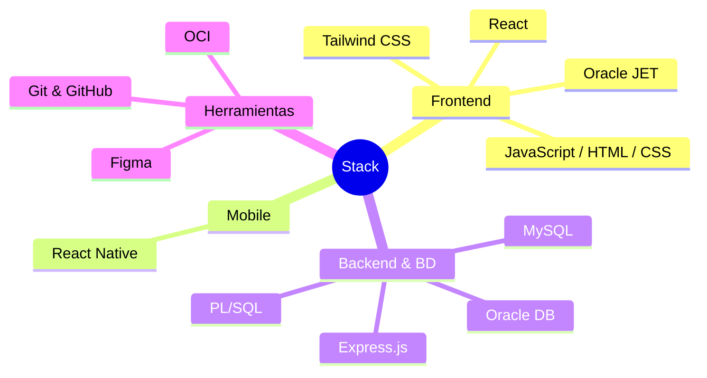

# ¡Bienvenido! 🚀

Hi there! I'm Humberto. I build web and mobile apps that people actually love using. As a Software Engineer with a passion for UX, I focus on making technology simple and intuitive. Let's chat! Reach out via email or LinkedIn.

  

    
    
  

---

### Tech Stack

 

  

---

### 🏆 Certifications

<table>
<td align="center" width="220">

 
 
<b>OCI 2025  Certified Developer Professional</b>
</td>
<td align="center" width="220">

  <b>OCI 2025  Certified Foundations Associate</b>
</td>
</table>

---

